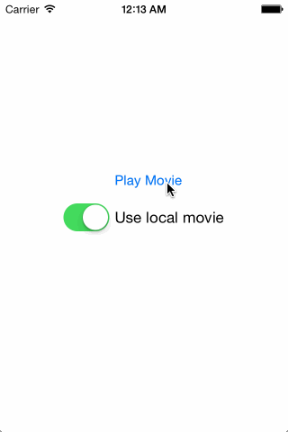

## About

[](http://cocoadocs.org/docsets/MPMoviePlayerController-XCDOverlayView/)
[](http://cocoadocs.org/docsets/MPMoviePlayerController-XCDOverlayView/)
[](LICENSE)

Displaying some information in overlay to a movie is an easy task. Synchronizing the overlay with the playback controls of `MPMoviePlayerController` is a hard task. **MPMoviePlayerController+XCDOverlayView** lets you add your own view to a `MPMoviePlayerController` and automatically synchronizes it with the playback controls.



## Requirements

- Runs on iOS 7.0 and later

## Installation

MPMoviePlayerController+XCDOverlayView is available through CocoaPods.

```ruby
pod "MPMoviePlayerController+XCDOverlayView", "~> 1.0.0"
```

Alternatively, you can manually use the provided static library. In order to do so you must:

1. Create a workspace (File → New → Workspace…)
2. Add your project to the workspace
3. Add the MPMoviePlayerController+XCDOverlayView project to the workspace
4. Drag and drop the `libMPMoviePlayerController+XCDOverlayView.a` file referenced from MPMoviePlayerController+XCDOverlayView → Products → libMPMoviePlayerController+XCDOverlayView.a into the *Link Binary With Libraries* build phase of your app’s target.

These steps will ensure that `#import <MPMoviePlayerController+XCDOverlayView/MPMoviePlayerController+XCDOverlayView.h>` will work properly in your project.

## Usage

MPMoviePlayerController+XCDOverlayView is a category on MPMoviePlayerController which adds a single property:

```objc
@property (nonatomic, strong) UIView *overlayView_xcd;
```

Here is a basic usage example:

```objc
MPMoviePlayerViewController *moviePlayerViewController = [[MPMoviePlayerViewController alloc] initWithContentURL:movieURL];
[self presentMoviePlayerViewControllerAnimated:moviePlayerViewController];
UIView *overlayView = [UIView new];
// Add subviews to overlayView
moviePlayerViewController.moviePlayer.overlayView_xcd = overlayView;
```

The `overlayView` will be automatically resized to always fit between the top and bottom playback control views. The easiest way to position your views is to use Auto Layout inside the overlay view. See the demo project for an example of subviews centered and aligned at the top and bottom.

## Limitations

* MPMoviePlayerController+XCDOverlayView only works with full screen movie player controllers.

* Although MPMoviePlayerController+XCDOverlayView doesn't user private APIs, it relies on implementation details, see the `PlaybackControlViews` function.

## License

MPMoviePlayerController+XCDOverlayView is available under the MIT license. See the [LICENSE](LICENSE) file for more information.
